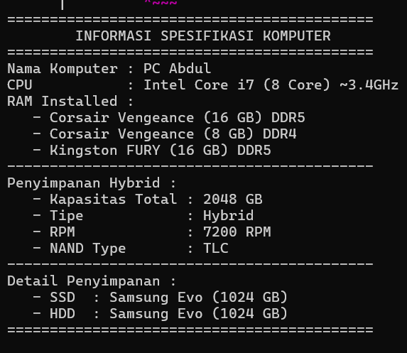

# TP3DPBO2025C2

# JANJI

Saya Rexy Putra Nur Laksana dengan NIM 2309578 mengerjakan TP 3 dalam mata kuliah Desain dan Pemrograman Berorientasi Objek untuk keberkahanNya maka saya tidak melakukan kecurangan seperti yang telah dispesifikasikan. Aamiin.

## Diagram

## Alasan Desain
1. inheritance untuk komponen
   Kelas Komponen sebagai superclass digunakan untuk merepresentasikan atribut umum dari semua komponen, seperti merk dan nama.
   Subkelas seperti Cpu, Ram, Harddrive, dan Ssd mewarisi kelas Komponen agar memiliki atribut yang lebih spesifik sesuai dengan jenisnya.

2. Multiple Inheritance untuk HybridStorage
   Kelas HybridStorage merupakan hasil kombinasi dari Harddrive dan Ssd, sehingga menggunakan Multiple Inheritance untuk mewarisi atribut dan metode dari kedua kelas tersebut.
   Pendekatan ini memungkinkan HybridStorage memiliki atribut tambahan seperti rpm dan nandType untuk membedakan karakteristiknya dari Harddrive dan Ssd biasa.

3. Hierarchical Inheritance untuk Komponen
   Kelas Cpu, Ram, Harddrive, dan Ssd merupakan subclass dari Komponen, sehingga struktur pewarisannya membentuk Hierarchical Inheritance.
   Dengan desain ini, semua komponen dapat berbagi atribut dasar yang sama, sehingga mempermudah pengelolaan dan pengembangan fitur di masa depan. 

4. Composite antara Komputer & Komponen
   Kelas Komputer memiliki hubungan "Use" (Asosiasi) dengan Cpu, Ram, Harddrive, dan HybridStorage.Ini mencerminkan bagaimana sebuah komputer menggunakan berbagai komponen untuk bekerja sebagai sistem yang utuh.
   **List pada atribut ramList di kelas **Komputer memungkinkan komputer memiliki lebih dari satu modul RAM, sehingga pengguna dapat menambahkan RAM baru dengan metode addRam().

## Alur Program
Program dimulai dengan mengaktifkan mode sinkronisasi input-output untuk meningkatkan efisiensi. Beberapa objek komponen komputer dibuat, seperti Cpu dengan spesifikasi tertentu (misalnya 8 core, 3.4 GHz, Intel Core i7), Ram dengan kapasitas dan jenis tertentu, Harddrive sebagai penyimpanan berbasis SSD, dan HybridStorage yang merupakan kombinasi SSD dan HDD. Setelah itu, objek Komputer dibuat menggunakan objek-objek yang telah didefinisikan di atas. RAM tambahan ditambahkan ke komputer menggunakan metode addRam().

Setelah semua komponen ditambahkan, program menampilkan informasi spesifikasi komputer ke layar, termasuk nama komputer, detail CPU, daftar RAM yang terpasang, detail penyimpanan (SSD dan HDD), serta detail penyimpanan hybrid seperti kapasitas total, tipe drive, RPM, dan jenis NAND. Setelah semua informasi ditampilkan, program selesai dijalankan.

## Dokumentasi

### CPP

### PYTHON

### JAVA

